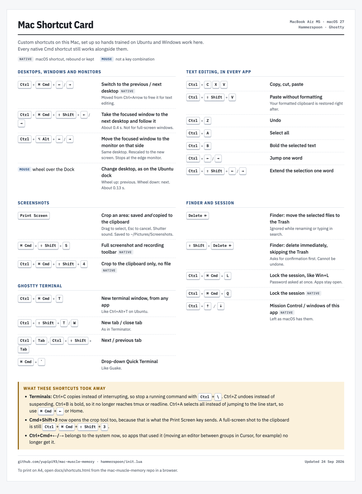
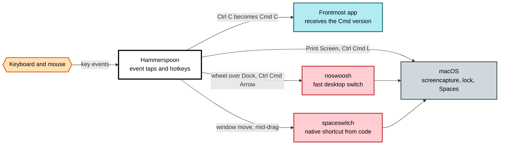

<h1 align="center">mac-muscle-memory</h1>

<p align="center">
  <b>Make macOS obey hands trained on Ubuntu and Windows.</b><br>
  Ctrl to copy, Ctrl+Arrow to jump words, Print Screen to crop, Delete to trash,<br>
  scroll over the Dock to change desktop. Native Spaces, SIP untouched, one command to install.
</p>

<p align="center">
  
  
  
  
  
</p>

<p align="center">
  <a href="docs/shortcuts.html"></a>
  <br><sub>The whole setup on one printable A4 card: <a href="docs/shortcuts.html"><code>docs/shortcuts.html</code></a></sub>
</p>

---

## Why

Switching to a Mac after years of Linux means fighting your own fingers: Ctrl+C does nothing,
Ctrl+Arrow flies across desktops, Print Screen is not a thing, Delete will not delete a file, and
changing desktop plays a one-second animation you cannot turn off. This repository fixes that on
one real machine, keeps the reasoning for every decision, and records what macOS 27 broke along
the way so nobody has to rediscover it.

## What you get

| Keys | Does | On a stock Mac |
|------|------|----------------|
| <kbd>Ctrl</kbd> <kbd>C</kbd> / <kbd>X</kbd> / <kbd>V</kbd> / <kbd>Z</kbd> / <kbd>A</kbd> / <kbd>B</kbd> | copy, cut, paste, undo, select all, bold, in every app | Cmd instead of Ctrl |
| <kbd>Ctrl</kbd> <kbd>Shift</kbd> <kbd>V</kbd> | paste without formatting, in every app | a different shortcut per app, or none |
| <kbd>Ctrl</kbd> <kbd>←</kbd> <kbd>→</kbd>, add <kbd>Shift</kbd> to select | jump and select by word | Option+Arrow |
| <kbd>Print Screen</kbd> | crop an area, save it **and** copy it | no such key |
| <kbd>Delete</kbd> / <kbd>Shift</kbd> <kbd>Delete</kbd> in Finder | move to Trash / delete immediately, with confirmation | Cmd+Backspace / Option+Cmd+Backspace |
| Mouse wheel over the Dock | previous / next desktop, like the Ubuntu dock | nothing |
| <kbd>Ctrl</kbd> <kbd>Cmd</kbd> <kbd>←</kbd> <kbd>→</kbd> | switch desktop, about 0.13 s | Ctrl+Arrow, about 1.2 s |
| <kbd>Ctrl</kbd> <kbd>Cmd</kbd> <kbd>Shift</kbd> <kbd>←</kbd> <kbd>→</kbd> | take the window to the next desktop | drag it to the screen edge and wait |
| <kbd>Ctrl</kbd> <kbd>Alt</kbd> <kbd>←</kbd> <kbd>→</kbd> | move the window to the next monitor | drag it across |
| <kbd>Ctrl</kbd> <kbd>Cmd</kbd> <kbd>L</kbd> | lock the session, like Win+L | Ctrl+Cmd+Q |
| <kbd>Ctrl</kbd> <kbd>Cmd</kbd> <kbd>T</kbd> | new terminal window, like Ctrl+Alt+T | nothing |
| <kbd>Ctrl</kbd> <kbd>Shift</kbd> <kbd>T</kbd> / <kbd>W</kbd> in Ghostty | new tab / close tab, as in Terminator | Cmd+T / Cmd+W |

Plus: the mouse wheel scrolls like Windows and Linux, desktops keep a fixed order, screenshots
land in `~/Pictures/Screenshots` instead of the Desktop, and Ghostty is set up with Linux
terminal shortcuts and a drop-down Quick Terminal. Every native Cmd shortcut keeps working.

## Measured, not guessed

Every change was timed or read back from the system before being called done.

| | Before | After |
|--|-------:|------:|
| Switch desktop | 1165 ms | **130 ms** |
| Take a window to the next desktop | 980 ms, plus waiting for you to let go of the keys | **360 to 410 ms** |
| Screenshot key | did nothing useful | crop, save, copy, shutter sound |

## Quick start

```bash
git clone https://github.com/yupipi93/mac-muscle-memory.git
cd mac-muscle-memory
bin/apply.sh      # idempotent: settings, tools, config symlinks
bin/capture.sh    # read-only check that the machine matches the repo
```

Then the few things macOS only lets a human do, listed in
[`docs/manual-steps.md`](docs/manual-steps.md): grant Hammerspoon **Accessibility** and
**Screen Recording**, turn on **Reduce motion**, and log out once.

Clone it anywhere. Nothing depends on the path.

### Your machine's details stay local

Serial numbers, display layouts, the remaps stored on your keyboard, backups you took: none of
that belongs in a public repo, but it is exactly what you want to remember. Keep it in
`personal/`, which is in `.gitignore`:

```bash
cp -R personal.example personal
```

## How it works



- **One Hammerspoon file does the remapping.** Keys are rewritten in event taps and the
  replacement is posted straight to the frontmost app, which sidesteps the modifier you are still
  holding. Changing the flags of the original event does nothing.
- **Desktop switching skips the animation** through [noswoosh](docs/tools.md#noswoosh), which uses
  a synthetic gesture. macOS 27 removed every setting for that animation; the evidence is in
  [`docs/macos-27-notes.md`](docs/macos-27-notes.md).
- **Moving a window between desktops** grabs its title bar and fires the native shortcut
  mid-drag, the one method that still works: macOS 27 answers the private "move window" call
  with *not implemented*.
- **Spaces stay native and shared across every monitor.** No SIP changes, no scripting additions.

## Make it yours

Tunables sit at the top of the relevant block in [`hammerspoon/init.lua`](hammerspoon/init.lua):

| Setting | Default | Effect |
|---------|---------|--------|
| `CLIPBOARD_PASSTHROUGH_APPS` | empty | apps that keep native Ctrl behaviour, e.g. your terminal |
| `HINT_DURATION` | `0.114` | length of the directional sweep drawn on desktop switch |
| `SCREENSHOT_SOUND` | `true` | shutter sound on Print Screen |
| `FINDER_DELETE_ENABLED` | `true` | Delete and Shift+Delete in Finder |
| `SCROLL_INVERT` | `false` | flip the Dock scroll direction |

Every setting and the reason behind it: [`docs/settings.md`](docs/settings.md).

## Trade-offs

Ctrl now means "Windows Ctrl" everywhere, terminals included, by choice:

- **Ctrl+C copies instead of interrupting.** Stop a command with <kbd>Ctrl</kbd> <kbd>\\</kbd>.
- **Ctrl+Z undoes instead of suspending**, and **Ctrl+A selects all** instead of jumping to the
  line start (use <kbd>Cmd</kbd> <kbd>←</kbd>).
- **Ctrl+B is bold**, so it no longer reaches tmux, whose default prefix it is.
- **Cmd+Shift+3** opens the crop tool too, because that is what the Print Screen key sends.

Put an app in `CLIPBOARD_PASSTHROUGH_APPS` to give it its native behaviour back.

## Documentation

| File | What is in it |
|------|---------------|
| [`docs/shortcuts.html`](docs/shortcuts.html) | the printable one-page shortcut card |
| [`docs/settings.md`](docs/settings.md) | every setting, why it is set, how it was verified |
| [`docs/tools.md`](docs/tools.md) | each installed tool, its config and the permissions it needs |
| [`docs/macos-27-notes.md`](docs/macos-27-notes.md) | what is broken in macOS 27 and what replaced it |
| [`docs/manual-steps.md`](docs/manual-steps.md) | what only a human can do, and why |
| [`personal.example/`](personal.example/) | template for your own private notes, kept out of git |
| [`OPEN-ITEMS.md`](OPEN-ITEMS.md) | what is unfinished or unverified |
| [`CHANGELOG.md`](CHANGELOG.md) | dated log of every change |
| [`AGENTS.md`](AGENTS.md) | rules for an AI agent working on this repo |

## Repository map

```
bin/apply.sh             apply everything that can be scripted, idempotent
bin/capture.sh           drift check against what this repo expects
bin/measure-switch.sh    time a desktop switch
hammerspoon/init.lua     every custom shortcut, symlinked to ~/.hammerspoon/init.lua
ghostty/config           terminal config, symlinked to ~/.config/ghostty/config
helper/spaceswitch.c     tiny injector for the native desktop shortcut
docs/                    everything above, plus the shortcut card and its screenshot
personal.example/        template for personal/, your gitignored private notes
```

## Tested on

A MacBook Air with Apple M5 on macOS 27.0, three displays sharing one set of Spaces. Several workarounds exist because of how macOS 27 behaves; on another
version, read [`docs/macos-27-notes.md`](docs/macos-27-notes.md) before trusting them, and run
`bin/capture.sh` after installing.

## License

[MIT](LICENSE). noswoosh and Hammerspoon are separate projects under their own licenses; this
repository only downloads and configures them.
